# 复现任务1
## 训练分类网络
按照Towards Evaluating the Robustness of Neural Networks 中TABLE1的内容**搭建CNN**，并**在MNIST和CIFAR10上训练**。并在MNIST测试集上达到99.5%左右的准确率，在CIFAR10测试集上达到90%的准确率。（在CIFAR10上使用数据增强）

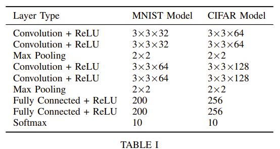

超参数略不同于原论文中 table 2 给出的超参数，因为发现完全按照原论文给出的超参数没办法达到 Accuracy 的要求（也可能是我的实现问题，但感觉原论文有些地方稍微有点模糊）。

### CNN on MNIST
**Accuracy：99.54%**

### CNN on CIFAR-10（数据增强）
**Accuracy：90.26%**

### ResNet18 on CIFAR-10（数据增强）
**Accuracy：95.4%**

## 使用三种方式攻击模型
### FGSM
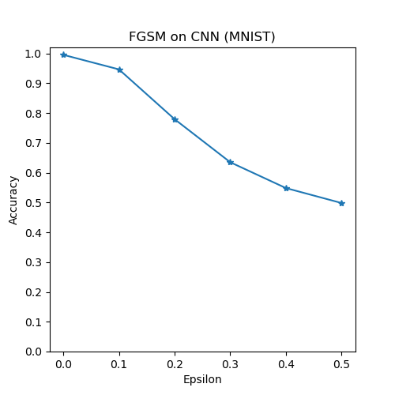
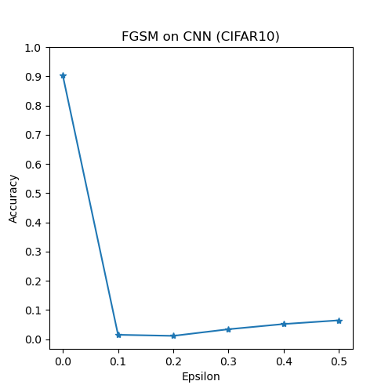
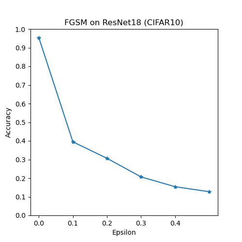
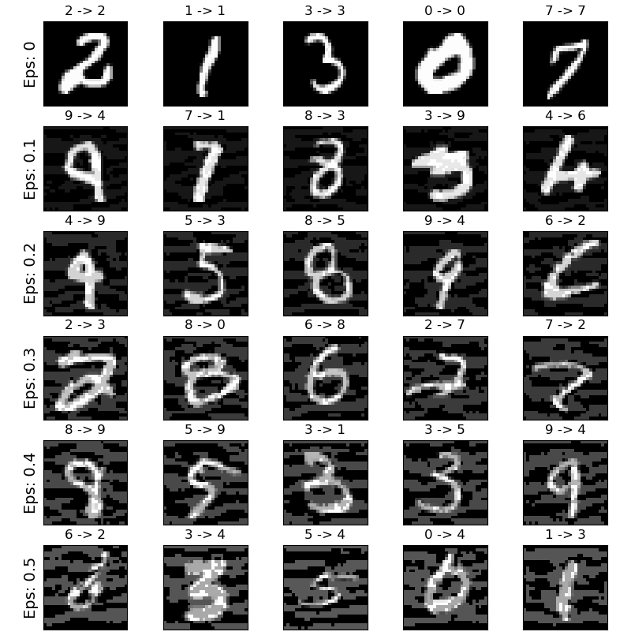

### PGD
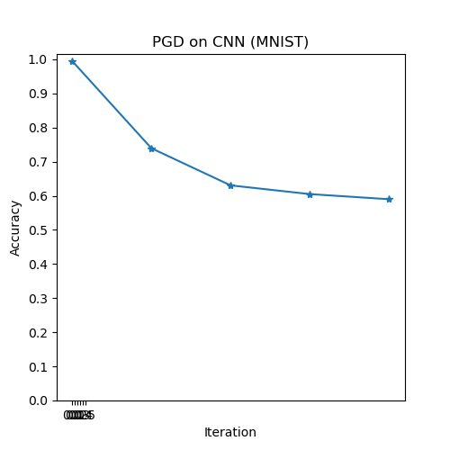
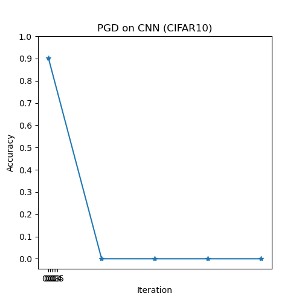
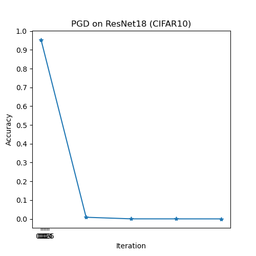
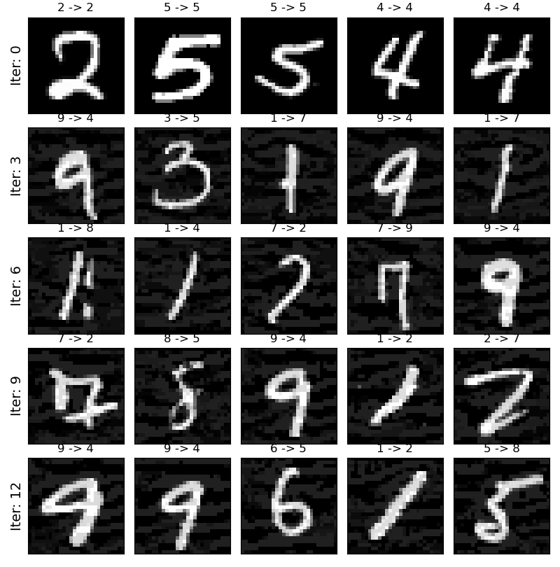

### C&W
CW attack参数：
`targeted=False, c=1e-4, kappa=0, max_iter=10, learning_rate=0.01`

**CW on CNN (MNIST) :**

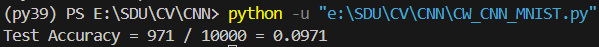

**CW on CNN (CIFAR10) :**

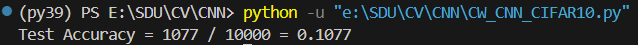

**CW on ResNet18 (CIFAR10) :**

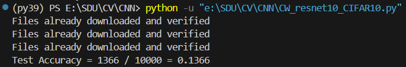